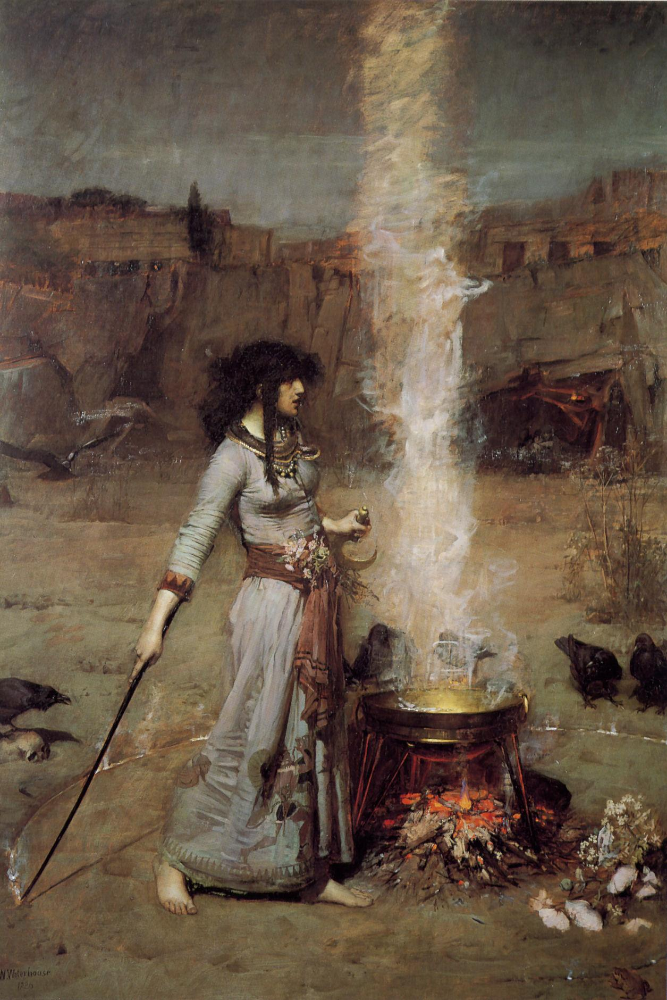

# Games_de_halloween

**O nome da pintura é The Magic Circle do artista John William Waterhouse** 
### trata-se de um simples game de advinhação, dentro da temática Halloween.

#Conhecimentos praticados:
1.Algoritmo.
2.Sintaxe.
3.try/except.
4.Estrutura de repetição.
5.Estrutura condicional composta.

[Meu LinkedIn](https://www.linkedin.com/in/esdras-abdir-issacar-a04862375/)